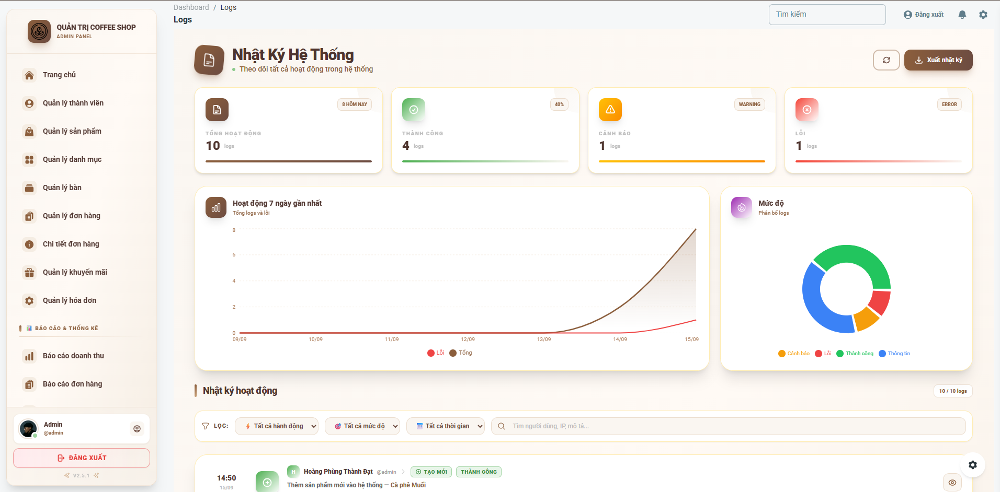
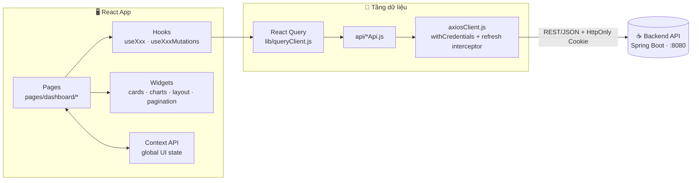
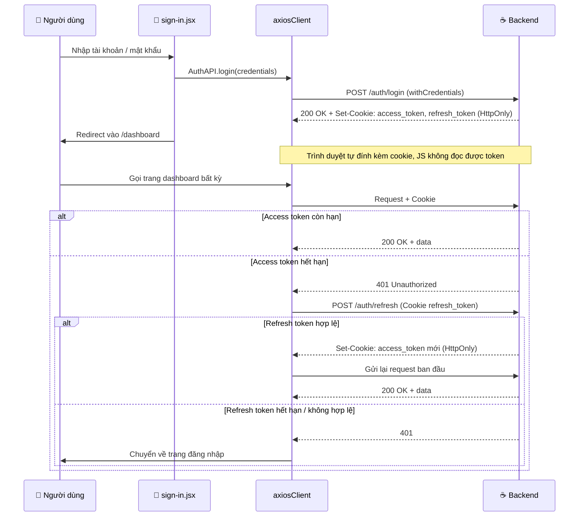

<div align="center">


#  Coffee Shop Admin Dashboard
## Giao Diện Quản Trị (Frontend — Admin)

**Một nơi duy nhất để vận hành cả quán cà phê — sản phẩm, đơn hàng, bàn, hóa đơn, khuyến mãi, nhật ký hệ thống, báo cáo và thống kê**

[](./CHANGELOG.md)
[](./LICENSE)
[](https://react.dev/)
[](https://vitejs.dev/)

[](https://tailwindcss.com/)
[](https://www.material-tailwind.com/)
[](https://axios-http.com/)
[](https://reactrouter.com/)
[](#-authentication--bảo-mật)
[](#-authentication--bảo-mật)

<br>



<sub>Giao diện minh họa — Material Tailwind Dashboard</sub>

</div>

<br>

<div align="center">

### 🧭 Một phần của hệ sinh thái Coffee Shop Management

| ☕ `cafe` (Backend) | 🛠️ `Frontend(Coffee-Admin)` | 👨‍💼 `Frontend(Coffee-Staff)` |
|:---:|:---:|:---:|
| Spring Boot · MySQL · WebSocket | **Bạn đang ở đây** — toàn quyền vận hành hệ thống | Giao diện nhân viên — đơn hàng, bàn, thanh toán |

</div>

---

## 📑 Mục lục

<table>
<tr>
<td valign="top" width="50%">

- [📋 Giới thiệu](#-giới-thiệu)
- [✨ Tính năng chính](#-tính-năng-chính)
- [📈 Báo cáo & Nhật ký hệ thống](#-báo-cáo--nhật-ký-hệ-thống)
- [📄 Phân trang chuẩn production](#-phân-trang-chuẩn-production)
- [🏗️ Kiến trúc ứng dụng](#️-kiến-trúc-ứng-dụng)
- [🛠️ Công nghệ sử dụng](#️-công-nghệ-sử-dụng)
- [📂 Cấu trúc thư mục](#-cấu-trúc-thư-mục)
- [🧩 Convention của một module](#-convention-của-một-module)

</td>
<td valign="top" width="50%">

- [🚀 Cài đặt và chạy dự án](#-cài-đặt-và-chạy-dự-án)
- [🔐 Authentication & Bảo mật](#-authentication--bảo-mật)
- [📡 API Integration](#-api-integration)
- [🐛 Xử lý sự cố](#-xử-lý-sự-cố-thường-gặp)
- [🚀 Deployment](#-deployment)
- [🗺️ Roadmap](#️-roadmap)
- [🤝 Contributing](#-contributing)

</td>
</tr>
</table>

---

## 📋 Giới thiệu

> **Coffee Shop Admin Dashboard** là giao diện quản trị (Admin Panel) cho hệ thống quản lý quán cà phê, cho phép chủ quán vận hành toàn bộ nghiệp vụ từ một nơi duy nhất: sản phẩm, danh mục, đơn hàng, bàn, hóa đơn, khuyến mãi, người dùng, nhật ký hệ thống và báo cáo — với dữ liệu thống kê trực quan.

Dự án được thiết kế theo hướng **module hóa theo tính năng (feature-based)**: mỗi nghiệp vụ là một thư mục độc lập gồm trang, component, hook, schema validate, hằng số và hàm tiện ích riêng; tầng gọi API được tách riêng trong `src/api/`.

> 🔗 Đây là phần **Frontend (Admin)**, hoạt động cùng **Backend API** (Spring Boot, `http://localhost:8080`) và **Frontend (Coffee-Staff)** dành cho nhân viên.

<div align="center">

### 🎯 Điểm đáng chú ý

</div>

| | |
|---|---|
| 🧩 | **Module hóa triệt để** — mỗi nghiệp vụ theo cùng convention `index / create / edit / show` + `components / constants / hooks / schemas / utils` |
| 📄 | **Phân trang chuẩn production** — áp dụng cho `product`, `orders`, `orderitems`, `bill`; tải dữ liệu theo từng trang, giữ nguyên bộ lọc/tìm kiếm khi chuyển trang |
| 📊 | **Báo cáo hoàn chỉnh** — báo cáo doanh thu và báo cáo đơn hàng với bộ lọc thời gian, biểu đồ và bảng số liệu |
| 📝 | **Nhật ký hệ thống (Log)** — theo dõi hoạt động trong hệ thống phục vụ kiểm tra và truy vết |
| 🔐 | **Auth an toàn** — Access Token + Refresh Token lưu trong **HttpOnly cookie**, JavaScript không thể đọc được token → giảm rủi ro bị đánh cắp qua XSS |
| ♻️ | **Tự động refresh phiên** — khi access token hết hạn, axios interceptor tự gọi refresh và thử lại request |
| 🗂️ | **Quản lý dữ liệu server bằng React Query** — cache, refetch, invalidate sau mỗi mutation (`src/lib/queryClient.js`) |
| ✅ | **Validate form bằng schema** — mỗi module có `schemas/*Schema.js` tách biệt khỏi giao diện |

---

## ✨ Tính năng chính

<table>
<tr>
<td width="50%" valign="top">

### 🏠 Dashboard (`home.jsx`)
- Thống kê tổng quan bằng `StatisticsCard`
- Biểu đồ phân tích bằng `StatisticsChart`

### 👥 Quản lý Người dùng (`user/`)
- CRUD người dùng
- Phân vai trò và hiển thị theo `roleConfig`
- Upload avatar (`UserAvatarUpload`)

### 📦 Quản lý Sản phẩm (`product/`)
- CRUD sản phẩm kèm upload hình ảnh
- Lọc theo danh mục, tìm kiếm
- Cảnh báo tồn kho (`ProductStockWarning`)
- **Phân trang** danh sách sản phẩm

### 🏷️ Quản lý Danh mục (`category/`)
- CRUD danh mục sản phẩm
- Thống kê và tìm kiếm danh mục

### 🪑 Quản lý Bàn (`tables/`)
- CRUD bàn trong quán
- Lọc theo trạng thái, xem trước thẻ bàn (`TablePreviewCard`)

</td>
<td width="50%" valign="top">

### 📋 Quản lý Đơn hàng (`orders/`)
- Danh sách, lọc, tìm kiếm đơn hàng
- Cập nhật trạng thái (`orderStatus`)
- Xem trước hóa đơn đơn hàng (`OrderReceiptPreview`)
- **Phân trang** danh sách đơn hàng

### 🧾 Chi tiết đơn hàng (`orderitems/`)
- CRUD các món trong đơn
- Theo dõi thay đổi từng món (`OrderItemChangeIndicator`)
- Xem trước phiếu (`OrderItemReceiptPreview`)
- **Phân trang** danh sách chi tiết đơn hàng

### 💰 Quản lý Hóa đơn (`bill/`)
- Tạo, xem, chỉnh sửa hóa đơn
- Cấu hình phương thức thanh toán (`paymentConfig`)
- Xem trước biên lai (`BillReceiptPreview`)
- **Phân trang** danh sách hóa đơn

### 🎁 Quản lý Khuyến mãi (`promotions/`)
- CRUD chương trình khuyến mãi
- Chọn sản phẩm áp dụng (`ProductSelector`)
- Xem trước voucher (`VoucherPreviewCard`)

### 📝 Nhật ký hệ thống (`log/`) ✅
- Theo dõi lịch sử hoạt động trong hệ thống

### 📈 Báo cáo (`reports/`)
- `revenue.jsx` — báo cáo doanh thu ✅
- `order-report.jsx` — báo cáo đơn hàng ✅
- `inventory-report.jsx` — báo cáo tồn kho

### 🧰 Các trang khác
- `campaigns` · `reviews` · `roles` · `settings` · `help` · `profile`

</td>
</tr>
</table>

> 🔑 Các module nghiệp vụ chính (`user`, `product`, `category`, `orders`, `orderitems`, `bill`, `tables`, `promotions`) đều tuân theo cùng một convention thư mục — xem [Convention của một module](#-convention-của-một-module).

---

## 📈 Báo cáo & Nhật ký hệ thống

| Trang | File | Mô tả | Trạng thái |
|---|---|---|:---:|
| 💵 Báo cáo doanh thu | `reports/revenue.jsx` | Thống kê doanh thu theo khoảng thời gian, biểu đồ xu hướng và bảng số liệu | ✅ Hoàn thiện |
| 🧾 Báo cáo đơn hàng | `reports/order-report.jsx` | Thống kê số lượng và trạng thái đơn hàng theo khoảng thời gian | ✅ Hoàn thiện |
| 📦 Báo cáo tồn kho | `reports/inventory-report.jsx` | Theo dõi tồn kho sản phẩm | ✅ Hoàn thiện |
| 📝 Nhật ký hệ thống | `log/index.jsx` | Lịch sử hoạt động trong hệ thống để kiểm tra và truy vết | ✅ Hoàn thiện |

---

## 📄 Phân trang chuẩn production

Các trang danh sách có lượng dữ liệu lớn đều dùng cơ chế phân trang thống nhất, thay vì tải toàn bộ dữ liệu một lần:

| Module | Trang danh sách | Trạng thái |
|---|---|:---:|
| 📦 Sản phẩm | `product/index.jsx` | ✅ |
| 📋 Đơn hàng | `orders/index.jsx` | ✅ |
| 🧾 Chi tiết đơn hàng | `orderitems/index.jsx` | ✅ |
| 💰 Hóa đơn | `bill/index.jsx` | ✅ |

**Nguyên tắc áp dụng:**

- 🔌 **Dùng chung một component** `widgets/pagination/Pagination` cho mọi trang → giao diện và hành vi đồng nhất
- 📡 **Tải dữ liệu theo từng trang** qua React Query; mỗi trang được cache riêng, chuyển trang mượt và không nhấp nháy
- 🔎 **Giữ nguyên bộ lọc & tìm kiếm** khi chuyển trang; tự quay về trang 1 khi thay đổi điều kiện lọc
- 🔄 **Invalidate đúng cache** sau khi tạo / sửa / xóa để danh sách luôn chính xác
- 🧱 **Tách logic ra hook** (`useXxx`) — page chỉ ghép component, không xử lý phân trang trực tiếp

---

## 🏗️ Kiến trúc ứng dụng



---

## 🛠️ Công nghệ sử dụng

<div align="center">


</div>

| Hạng mục | Công nghệ |
|---|---|
| **Framework** | React 18+ với Vite |
| **UI Library** | Material Tailwind (`@material-tailwind/react`) |
| **Styling** | TailwindCSS 3+ |
| **HTTP Client** | Axios (`withCredentials: true`) |
| **Server State** | React Query (`src/lib/queryClient.js`) |
| **Routing** | React Router DOM v6 |
| **Global State** | React Context API (`src/context`) |
| **Form & Validation** | Custom hooks (`useXxxForm`) + schema (`schemas/*Schema.js`) |
| **Phân trang** | Component dùng chung `widgets/pagination` + hook theo từng module |
| **Thông báo** | Toast helper (`src/lib/toast.js`) |
| **Biểu đồ** | `StatisticsChart` + cấu hình tại `configs/charts-config.js` |
| **Authentication** | Access Token + Refresh Token trong **HttpOnly Cookie** |
| **Deploy** | Genezio (`genezio.yaml`), Vercel, Netlify |

---

## 📂 Cấu trúc thư mục

```
Frontend(Coffee-Admin)/
├── 📁 public/
│   ├── css/tailwind.css            # Tailwind CSS output
│   └── img/                        # Ảnh tĩnh, favicon, video demo
│
├── 📁 src/
│   ├── 📁 api/                     # Tầng giao tiếp API
│   │   ├── axiosClient.js          # Axios instance + interceptor refresh token
│   │   ├── AuthAPI.js              # Đăng nhập / refresh / đăng xuất
│   │   ├── userApi.js
│   │   ├── productApi.js           # Hỗ trợ phân trang
│   │   ├── categoryApi.js
│   │   ├── orderApi.js             # Hỗ trợ phân trang
│   │   ├── orderitemApi.js         # Hỗ trợ phân trang
│   │   ├── billApi.js              # Hỗ trợ phân trang
│   │   ├── tableApi.js
│   │   └── promotionApi.js
│   │
│   ├── 📁 configs/                 # charts-config.js, index.js
│   ├── 📁 context/                 # Global state (React Context)
│   ├── 📁 data/                    # Dữ liệu tĩnh cho thống kê (cards, charts)
│   ├── 📁 layouts/                 # auth.jsx, dashboard.jsx
│   ├── 📁 lib/                     # queryClient.js, toast.js
│   │
│   ├── 📁 pages/
│   │   ├── 📁 auth/                # sign-in.jsx, sign-up.jsx
│   │   └── 📁 dashboard/
│   │       ├── home.jsx            # Trang tổng quan
│   │       ├── profile.jsx         # Hồ sơ người dùng
│   │       │
│   │       ├── 📁 user/            # ┐
│   │       ├── 📁 product/         # │
│   │       ├── 📁 category/        # │  Các module nghiệp vụ
│   │       ├── 📁 orders/          # │  (cùng convention, xem bên dưới)
│   │       ├── 📁 orderitems/      # │
│   │       ├── 📁 bill/            # │
│   │       ├── 📁 tables/          # │
│   │       ├── 📁 promotions/      # ┘
│   │       │
│   │       ├── 📁 reports/         # revenue ✅ · order-report ✅ · inventory-report 🚧
│   │       ├── 📁 log/             # Nhật ký hệ thống ✅
│   │       ├── 📁 campaigns/       # index.jsx
│   │       ├── 📁 reviews/         # index.jsx
│   │       ├── 📁 roles/           # index.jsx
│   │       ├── 📁 settings/        # index.jsx
│   │       └── 📁 help/            # index.jsx
│   │
│   ├── 📁 widgets/
│   │   ├── cards/                  # StatisticsCard, ProfileInfoCard, MessageCard
│   │   ├── charts/                 # StatisticsChart
│   │   ├── layout/                 # Sidenav, Navbar, DashboardNavbar, Footer, Configurator
│   │   ├── loaders/                # CoffeeLoader
│   │   └── pagination/             # Pagination (dùng chung cho các trang danh sách)
│   │
│   ├── App.jsx                     # Component gốc
│   ├── main.jsx                    # Entry point
│   └── routes.jsx                  # Định nghĩa route
│
├── .gitignore
├── CHANGELOG.md
├── ISSUE_TEMPLATE.md
├── LICENSE
├── README.md
├── genezio.yaml                    # Cấu hình deploy Genezio
├── index.html
├── jsconfig.json
├── package.json
├── postcss.config.cjs
├── prettier.config.cjs
├── tailwind.config.cjs
└── vite.config.js
```

---

## 🧩 Convention của một module

Mỗi module nghiệp vụ (ví dụ `product/`) có cùng một cấu trúc:

```
product/
├── 📁 components/      # UI riêng của module (Header, Search, Stats, Table, ...)
│   └── index.js        # Barrel export
├── 📁 constants/       # messages.js + cấu hình riêng (stockConfig.js, ...)
├── 📁 hooks/           # useProducts · useProductForm · useProductMutations · useProductStats
├── 📁 schemas/         # productSchema.js — validate dữ liệu form
├── 📁 utils/           # formatters.js — format tiền, ngày, trạng thái
├── index.jsx           # Danh sách (list) — có phân trang
├── create.jsx          # Tạo mới
├── edit.jsx            # Chỉnh sửa
└── show.jsx            # Xem chi tiết
```

| Lớp | Trách nhiệm |
|---|---|
| **Page** (`index/create/edit/show.jsx`) | Ghép component + hook, không chứa logic nghiệp vụ nặng |
| **Components** | Phần giao diện thuần, nhận dữ liệu qua props |
| **Hooks** | Lấy dữ liệu (query, phân trang), ghi dữ liệu (mutation), xử lý form, tính thống kê |
| **Schemas** | Quy tắc validate form |
| **Constants** | Thông báo, nhãn trạng thái, cấu hình hiển thị |
| **Utils** | Hàm format thuần |

> ➕ **Thêm module mới:** copy một module có sẵn, đổi tên, thêm file `api/xxxApi.js`, rồi khai báo route trong `src/routes.jsx`. Nếu trang danh sách có nhiều dữ liệu, dùng lại `widgets/pagination`.

---

## 🚀 Cài đặt và chạy dự án

### ✅ Yêu cầu hệ thống

| Yêu cầu | Phiên bản |
|---|---|
| Node.js | 16+ (khuyến nghị 18+) |
| npm / yarn | 8+ / 1.22+ |
| Backend API | đang chạy tại `http://localhost:8080` |

### ⚡ Các bước cài đặt

```bash
# 1️⃣ Clone repository
git clone https://github.com/HoangPhungThanhDat/<ten-repo>.git
cd "Frontend(Coffee-Admin)"

# 2️⃣ Cài đặt dependencies
npm install

# 3️⃣ Chạy development server
npm run dev
```

**Biến môi trường** — tạo file `.env` ở thư mục gốc:

```env
VITE_API_URL=http://localhost:8080/api
VITE_APP_NAME=Coffee Shop Admin
```

<div align="center">

🌐 Ứng dụng chạy tại **http://localhost:5173**

</div>

**Build production:**

```bash
npm run build      # Tạo bản build trong thư mục dist/
npm run preview    # Preview bản build
```

---

## 🔐 Authentication & Bảo mật

Hệ thống dùng cơ chế **Access Token + Refresh Token**, cả hai được backend gửi về qua **HttpOnly cookie**.

| Thành phần | Mô tả |
|---|---|
| **Access Token** | Token ngắn hạn, dùng để xác thực mỗi request tới API |
| **Refresh Token** | Token dài hạn, chỉ dùng để xin access token mới |
| **HttpOnly Cookie** | Token được lưu trong cookie mà JavaScript **không đọc được** (`document.cookie` / `localStorage` đều không thấy) → chống đánh cắp token qua XSS |
| **`withCredentials: true`** | Axios tự gửi cookie kèm mỗi request tới backend |
| **Auto Refresh** | Khi nhận `401`, interceptor gọi endpoint refresh, nhận cookie mới rồi gửi lại request ban đầu |
| **Logout** | Gọi API đăng xuất để backend xóa cookie; frontend chuyển về trang đăng nhập |

> 🛡️ Toàn bộ route trong dashboard là **Protected Routes** — chưa xác thực hoặc refresh thất bại sẽ tự động chuyển hướng về `/auth/sign-in`.

<details>
<summary><b>🔑 Xem sơ đồ luồng đăng nhập & refresh token</b></summary>



</details>

<details>
<summary><b>📄 Xem ví dụ cấu hình axiosClient với HttpOnly cookie</b></summary>

```javascript
// src/api/axiosClient.js
import axios from 'axios';

const axiosClient = axios.create({
  baseURL: import.meta.env.VITE_API_URL,
  withCredentials: true, // bắt buộc để trình duyệt gửi / nhận HttpOnly cookie
});

let isRefreshing = false;
let queue = [];

axiosClient.interceptors.response.use(
  (res) => res,
  async (error) => {
    const original = error.config;

    if (error.response?.status === 401 && !original._retry
        && !original.url.includes('/auth/')) {
      original._retry = true;

      if (isRefreshing) {
        // Các request đến sau chờ refresh xong rồi gửi lại
        return new Promise((resolve, reject) => queue.push({ resolve, reject }))
          .then(() => axiosClient(original));
      }

      isRefreshing = true;
      try {
        await axiosClient.post('/auth/refresh');
        queue.forEach((p) => p.resolve());
        return axiosClient(original);
      } catch (e) {
        queue.forEach((p) => p.reject(e));
        window.location.href = '/auth/sign-in';
        return Promise.reject(e);
      } finally {
        queue = [];
        isRefreshing = false;
      }
    }
    return Promise.reject(error);
  }
);

export default axiosClient;
```

</details>

### 🔧 Yêu cầu phía Backend

Để cookie hoạt động đúng, backend cần:

- Set cookie với `HttpOnly`, `Secure` (production/HTTPS) và `SameSite` phù hợp
- Cấu hình CORS **`allowCredentials(true)`** và `allowedOrigins` là origin cụ thể (**không** dùng `*`)
- Có endpoint refresh token và endpoint logout (xóa cookie)
- Các endpoint danh sách (`products`, `orders`, `order-items`, `bills`) hỗ trợ tham số phân trang

---

## 📡 API Integration

`src/api/axiosClient.js` chịu trách nhiệm:
- Cấu hình Base URL từ `VITE_API_URL`
- Bật `withCredentials` để gửi HttpOnly cookie
- Xử lý lỗi tập trung và tự động refresh token khi `401`

Mỗi nghiệp vụ có một file API riêng, được các hook (`useXxx`, `useXxxMutations`) gọi thông qua React Query:

<details>
<summary><b>📄 Xem ví dụ một module API (có phân trang)</b></summary>

```javascript
// src/api/productApi.js
import axiosClient from './axiosClient';

export const productApi = {
  // params: { page, size, keyword, categoryId, ... }
  getAll: (params) => axiosClient.get('/products', { params }),
  getById: (id) => axiosClient.get(`/products/${id}`),
  create: (data) => axiosClient.post('/products', data),
  update: (id, data) => axiosClient.put(`/products/${id}`, data),
  delete: (id) => axiosClient.delete(`/products/${id}`),
};
```

</details>

<details>
<summary><b>📄 Xem ví dụ hook lấy dữ liệu theo trang</b></summary>

```javascript
// src/pages/dashboard/product/hooks/useProducts.js
import { useState } from 'react';
import { useQuery, keepPreviousData } from '@tanstack/react-query';
import { productApi } from '@/api/productApi';

export function useProducts(filters = {}) {
  const [page, setPage] = useState(0);
  const [size, setSize] = useState(10);

  const query = useQuery({
    queryKey: ['products', { page, size, ...filters }],
    queryFn: () => productApi.getAll({ page, size, ...filters }),
    placeholderData: keepPreviousData, // giữ dữ liệu cũ khi đang tải trang mới
  });

  return { ...query, page, setPage, size, setSize };
}
```

</details>

---

## 🐛 Xử lý sự cố thường gặp

<details>
<summary><b>❌ Đăng nhập thành công nhưng request sau bị 401</b></summary><br>

Thường do cookie không được gửi kèm. Kiểm tra:
1. Axios đã bật `withCredentials: true`
2. Backend CORS có `allowCredentials(true)` và `allowedOrigins` là `http://localhost:5173` (không phải `*`)
3. Cookie `SameSite` / `Secure` phù hợp với môi trường (HTTP local khác HTTPS production)
4. Frontend và backend khác domain khi deploy → cần `SameSite=None; Secure`
</details>

<details>
<summary><b>❌ Lỗi CORS</b></summary><br>

```java
// Backend: CorsConfiguration
config.setAllowedOrigins(Arrays.asList("http://localhost:5173"));
config.setAllowCredentials(true);
```
</details>

<details>
<summary><b>❌ Danh sách hiển thị sai số trang / dữ liệu cũ sau khi thêm, sửa, xóa</b></summary><br>

1. Đảm bảo mutation gọi `invalidateQueries` đúng `queryKey` của module
2. Khi thay đổi bộ lọc hoặc từ khóa tìm kiếm, reset `page` về trang đầu
3. Kiểm tra backend trả đúng tổng số bản ghi / tổng số trang
</details>

<details>
<summary><b>❌ Port đã được sử dụng</b></summary><br>

Đổi port trong `vite.config.js`:
```javascript
server: {
  port: 3000,
}
```
</details>

<details>
<summary><b>❌ Không kết nối được API</b></summary><br>

1. Backend đang chạy tại `http://localhost:8080`
2. `VITE_API_URL` trong `.env` chính xác (restart `npm run dev` sau khi sửa `.env`)
3. Firewall không chặn kết nối
</details>

---

## 🚀 Deployment

<table>
<tr>
<td width="25%" align="center">

**Genezio**
```bash
genezio deploy
```
<sub>Cấu hình trong `genezio.yaml`</sub>
</td>
<td width="25%" align="center">

**Vercel**
```bash
npm run build
vercel --prod
```
</td>
<td width="25%" align="center">

**Netlify**
```bash
npm run build
netlify deploy --prod --dir=dist
```
</td>
<td width="25%" align="center">

**GitHub Pages**
```bash
npm run build
gh-pages -d dist
```
<sub>Set `base: '/repo-name/'` trong `vite.config.js`</sub>
</td>
</tr>
</table>

> ⚠️ Khi deploy production, frontend và backend dùng HttpOnly cookie nên cần **HTTPS** và cấu hình `Secure` / `SameSite` / CORS tương ứng.

---

## 🗺️ Roadmap

- [x] CRUD đầy đủ: người dùng, sản phẩm, danh mục, đơn hàng, chi tiết đơn, bàn, hóa đơn, khuyến mãi
- [x] Authentication Access Token + Refresh Token với HttpOnly cookie
- [x] Dashboard thống kê tổng quan
- [x] Tách module theo feature (components / hooks / schemas / constants / utils)
- [x] Phân trang chuẩn production cho `product`, `orders`, `orderitems`, `bill`
- [x] Hoàn thiện trang **Nhật ký hệ thống** (`log`)
- [x] Hoàn thiện **Báo cáo doanh thu** (`revenue`) và **Báo cáo đơn hàng** (`order-report`)
- [x] Hoàn thiện **Báo cáo tồn kho** (`inventory-report`)
- [x] Hoàn thiện các trang `campaigns`, `reviews`, `roles`, `settings`, `help`
- [ ] Áp dụng phân trang cho các module còn lại (`user`, `category`, `tables`, `promotions`)
- [ ] Dark mode
- [x] Export báo cáo Excel/PDF trực tiếp từ dashboard
- [ ] Viết unit test cho các component và hook chính
- [x] Thông báo đẩy (push notification) cho đơn hàng mới

---

## 🤝 Contributing

<table>
<tr>
<td width="20%" align="center">1️⃣<br><b>Fork</b></td>
<td width="20%" align="center">2️⃣<br><b>Tạo branch</b></td>
<td width="20%" align="center">3️⃣<br><b>Commit</b></td>
<td width="20%" align="center">4️⃣<br><b>Push</b></td>
<td width="20%" align="center">5️⃣<br><b>Pull Request</b></td>
</tr>
</table>

```bash
git checkout -b feature/AmazingFeature
git commit -m 'Add some AmazingFeature'
git push origin feature/AmazingFeature
```

---

<div align="center">

## 📄 Giấy phép & Liên hệ

Phát hành theo giấy phép **MIT** — xem chi tiết tại [`LICENSE`](./LICENSE)

**Tác giả: Hoàng Đạt**

[](mailto:hoangdat.engineer@gmail.com)
[](https://github.com/HoangPhungThanhDat)

<br>

☕ **Made with React & Vite — nơi vận hành toàn bộ quán cà phê** ⚛️

<sub>Nếu dự án hữu ích, đừng quên để lại ⭐ trên repository!</sub>

</div>